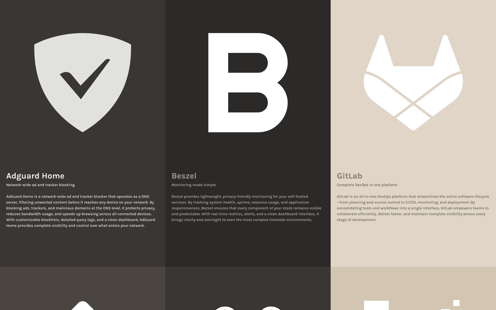
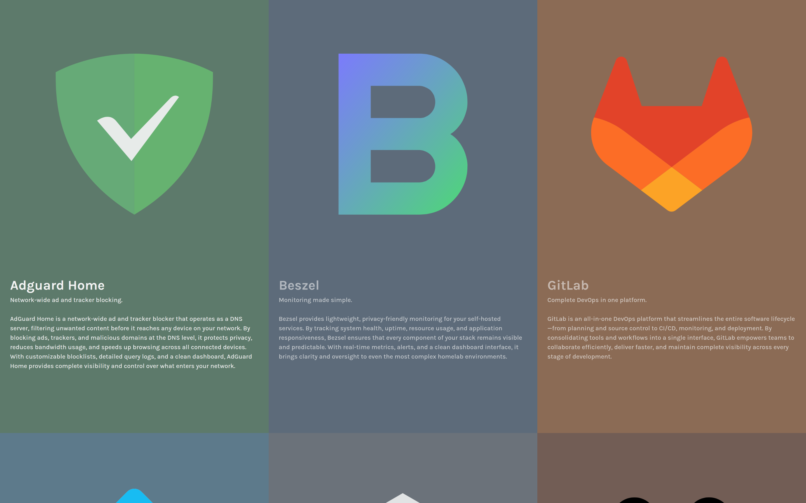

# Index

A self-hosted dashboard for organizing and accessing your web apps. 

Index provides a clean, customizable interface for managing links to your infrastructure, development tools, and applications with intelligent filtering based on network context.

**Preview #1**

**Preview #2**

## Configuration

Configuration is managed through a single JSON file that defines page defaults, service groups, and individual sites.

The structure is built around two main concepts: sites and groups. Sites represent individual services or applications you want to link to, while groups are collections of related sites that share common characteristics.

Groups contain multiple sites and cascade their properties down to each site within them. This inheritance model means you can define shared descriptions, taglines, and project links at the group level, and all sites automatically inherit these values unless they override them.

Both sites and groups support extensive customization. You can specify filters for IP addresses (with CIDR support), domains, or ports to control visibility. Custom styling is available through CSS properties, and icons can be configured using SVG paths. This gives you precise control over how each service appears and when it's displayed.

**Note** To create the configuration for your environment, you can provide the example in .devcontainer/etc/index/index.json and list the services you want and the conditions you want to an LLM and have it generate it for you, then customize further to get the final product.

## Development

The project includes a devcontainer configuration for a consistent development environment. Open the repository in code or any devcontainer-compatible editor.

To get started use `make develop` to start a PHP development server on port 8000. This is useful for rapid iteration on the interface and testing configuration changes.

## Installation

Run `make start` to build and launch the container with Docker Compose.

The Makefile provides commands for managing the application:
- `make logs` to view output
- `make restart` to reload
- `make stop` to shut down.

If you prefer running directly on your system, ensure you have PHP 8.2+ installed and create a configuration file at `/etc/index/index.json`.

## Usage

Once configured, Index filters and displays the appropriate services based on your connection context.

Access the dashboard through your configured domain or IP address, and it will show the services that match your current network environment.

## License

GPL-3.0
